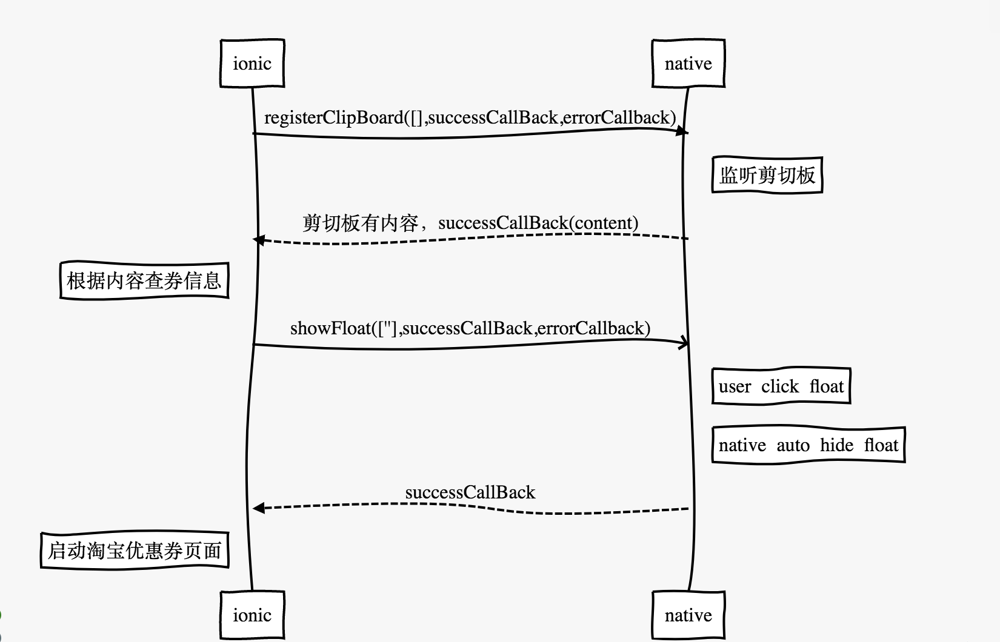

# ionic-float-native-android-library
the plugin name is **cordova-plugin-float-window**
the plugin clobbers name is **cordova.plugins.FloatWindow**
## How to install
```shell
cordova plugin add https://github.com/maruiwhu/ionic-float-native-android-library
```
## How to uninstall
```shell
cordova plugin rm cordova-plugin-float-window
```
### Api
#### 显示悬浮窗
showFloat(arg0, successCallBack, errorCallBack)

|    param |    type |   description  |
| --- | --- | --- |
|  arg0   |  array   |   显示的优惠券信息，需要传数组形式  |
|    successCallback |  	onSuccess（function）   |  点击悬浮窗事件会调用到这里   |
|errorCallBack  | onError(function) | 执行失败的回调|

 example：
```javascript
 cordova.plugins.FloatWindow.showFloat(['券：200.0 佣金：4.18 '],result=>alert(result),error=>alert(error))
 ```
#### 隐藏悬浮窗
hideFloat(arg0, successCallBack, errorCallBack)

|    param |    type |   description  |
| --- | --- | --- |
|  arg0   |  array   |   不需要参数，传空即可  |
|    successCallback |  	onSuccess（function）   |  调用成功   |
|errorCallBack  | onError(function) | 执行失败的回调|
example：
```javascript
cordova.plugins.FloatWindow.hideFloat([],result=>alert(result),error=>alert(error))
```
#### 注册监听剪切板
registerClipBoard(arg0, successCallBack, errorCallBack)
| --- | --- | --- |
|  arg0   |  array   |   不需要参数，传空即可  |
|    successCallback |  	onSuccess（function）   |  方法调用成功，剪切板有内容会调用这里   |
|errorCallBack  | onError(function) | 执行失败的回调|
example：
```javascript
cordova.plugins.FloatWindow.registerClipBoardListener([],result=>alert(result),error=>alert(error))
```
#### 解注册监听剪切板
unRegisterClipBoard(arg0, successCallBack, errorCallBack)

|    param |    type |   description  |
| --- | --- | --- |
|  arg0   |  array   |   不需要参数，传空即可  |
|    successCallback |  	onSuccess（function）   |  调用成功   |
|errorCallBack  | onError(function) | 执行失败的回调|
example： 
```javascript
cordova.plugins.FloatWindow.unRegisterClipBoardListener([],result=>alert(result),error=>alert(error))
```


## 调用时序图

```sequence
ionic->native: registerClipBoard([],successCallBack,errorCallback)
Note right of native: 监听剪切板
native-->ionic: 剪切板有内容，successCallBack(content)
Note left of ionic: 根据内容查券信息
ionic->>native: showFloat([''],successCallBack,errorCallback)
Note right of native: user click float
Note right of native: native auto hide float
native--> ionic: successCallBack
Note left of ionic: 启动淘宝优惠券页面 
```

